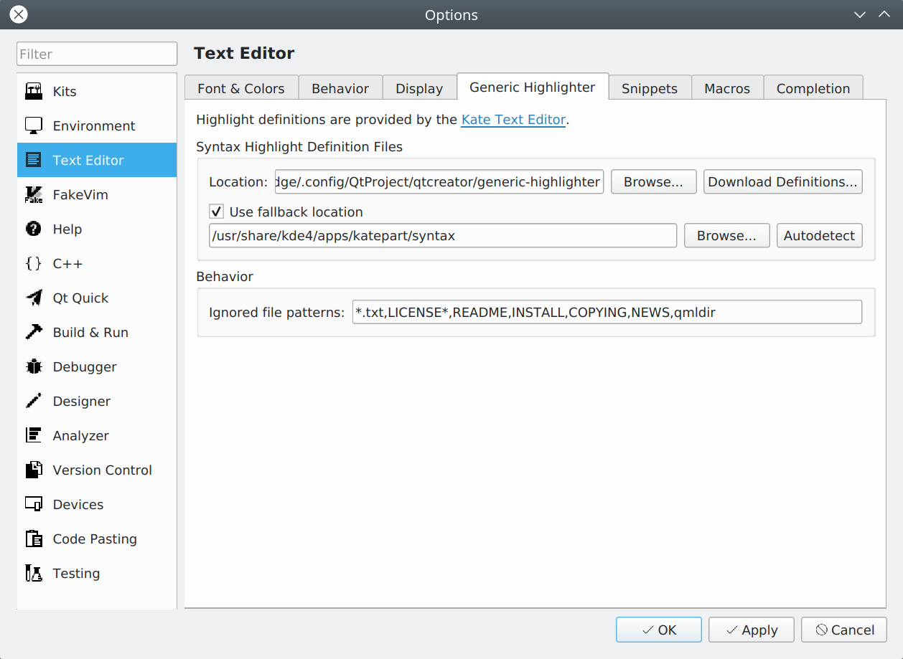

# Markdown in Qt Quick

The Text, TextEdit and TextArea items support rich text formatted in HTML.
Since Qt 5.14, they now support two dialects of Markdown as well:
[The CommonMark Specification](https://spec.commonmark.org/0.29/) is the
conservative formal specification, while
[GitHub Flavored Markdown](https://guides.github.com/features/mastering-markdown/#GitHub-flavored-markdown)
adds extra features such as task lists and tables.

If you are viewing this document in the Qt Quick Controls Text Editor example,
you can edit this document to explore Qt's rich text editing features.
We have included some comments in each of the following sections to
encourage you to experiment.

## Font and Paragraph Styles

Markdown supports **bold**, *italic*, ~~strikethrough~~ and `monospace` font
styles.

> A block quote is indented according to the convention for email quoting.

    A block of code;
    can be indented;
    with 4 spaces or a tab;

or

```
Block {
    id: code
    CanBe {
        wrappedBy: "triple backticks"
    }
}
```

Block quotes can be nested, and block quotes can include indented code blocks.

In [The CommonMark Specification](https://spec.commonmark.org/0.29/)
John MacFarlane writes:

> What distinguishes Markdown from many other lightweight markup syntaxes,
> which are often easier to write, is its readability. As Gruber writes:

> > The overriding design goal for Markdown's formatting syntax is to make it
> > as readable as possible. The idea is that a Markdown-formatted document should
> > be publishable as-is, as plain text, without looking like it's been marked up
> > with tags or formatting instructions. (
> > [http://daringfireball.net/projects/markdown/](http://daringfireball.net/projects/markdown/))

> The point can be illustrated by comparing a sample of AsciiDoc with an
> equivalent sample of Markdown. Here is a sample of AsciiDoc from the AsciiDoc
> manual:

>     1. List item one.
>     +
>     List item one continued with a second paragraph followed by an
>     Indented block.
>     +
>     .................
>     $ ls *.sh
>     $ mv *.sh ~/tmp
>     .................
>     +
>     List item continued with a third paragraph.
>
>     2. List item two continued with an open block.
>     ...
>

## Hyperlinks

Hyperlinks can be written with the link text first, and the URL immediately
following: [Qt Assistant](http://doc.qt.io/qt-5/qtassistant-index.html)

A plain url is automatically recognized: https://doc.qt.io/qt-5/qml-qtquick-text.html

There are also "reference links" where the link text is first labeled
and then the URL for the label is given elsewhere:
[The Qt Creator Manual][creatormanual]

## Images

Inline images like this one  flow with the surrounding text.

The code for including an image is just a link that starts with a bang.
An image in its own paragraph is given its own space:


## Lists

Different kinds of lists can be included. Standard bullet lists can be nested,
using different symbols for each level of the list. List items can have nested
items such as block quotes, code blocks and images. Check boxes can be included
to form a task list.

- Disc symbols are typically used for top-level list items.
  * Circle symbols can be used to distinguish between items in lower-level
    lists.
    + Square symbols provide a reasonable alternative to discs and circles.
  * Lists can be continued...
  * further down
- List items can include images: 
- and even nested quotes, like this:

  The [Qt Documentation](https://doc.qt.io/qt-5/qml-qtquick-textedit.html#details)
  points out that
  > The TextEdit item displays a block of editable, formatted text.
  >
  > It can display both plain and rich text. For example:
  >
  >     TextEdit {
  >          width: 240
  >          text: "<b>Hello</b> <i>World!</i>"
  >          font.family: "Helvetica"
  >          font.pointSize: 20
  >          color: "blue"
  >          focus: true
  >     }
- List items with check boxes allow task lists to be incorporated:
  * [ ] This task is not yet done
  * [x] We aced this one!

Ordered lists can be used for tables of contents, for example. Each number
should end with a period or a parenthesis:

1.  Markdown in Qt Quick
    1)  Font and Paragraph Styles
    5)  Hyperlinks
    3)  Images 
    2)  Lists
    4)  Tables
2.  Related work

The list will automatically be renumbered during rendering.

## Thematic Breaks

A horizontal rule is possible, as in HTML:

- - -

## Tables

One of the GitHub extensions is support for tables:

|             |Development Tools                   |Programming Techniques     |Graphical User Interfaces|
|-------------|------------------------------------|---------------------------|-------------------------|
|9:00 - 11:00 |Introduction to Qt                                                                      |||
|11:00 - 13:00|Using Qt Creator                    |QML and its runtime        |Layouts in Qt            |
|13:00 - 15:00|Qt Quick Designer Tutorial          |Extreme Programming        |Writing Custom Styles    |
|15:00 - 17:00|Qt Linguist and Internationalization|                           |                         |

# Related Work

Some Qt Widgets also support Markdown.
[QTextEdit](https://doc.qt.io/qt-5/qtextedit.html) has similar WYSIWYG
editing features as TextEdit and TextArea: you can edit the rendered text
directly. You can use
[QTextDocument::toMarkdown](https://doc-snapshots.qt.io/qt5-dev/qtextdocument.html#toMarkdown)
to rewrite the Markdown format, and save it back to a file.

If you have the [KDE Kate Editor](https://kate-editor.org/) installed on your
system, you probably also have the `markdown.xml` syntax highlighting
definition file; that can be reused to add Markdown syntax highlighting to
Qt Creator.



Qt owes thanks to the authors of the [MD4C parser](https://github.com/mity/md4c)
for making markdown import possible. The QTextMarkdownWriter class does not
have such dependencies, and also has not yet been tested as extensively, so we
do not yet guarantee that we are able to rewrite every Markdown document that
you are able to read and display with Text or TextEdit. But you are free to
write [bugs](https://bugreports.qt.io) about any troublesome cases that you
encounter.

[creatormanual]: https://doc.qt.io/qtcreator/ "Qt Creator Manual"
